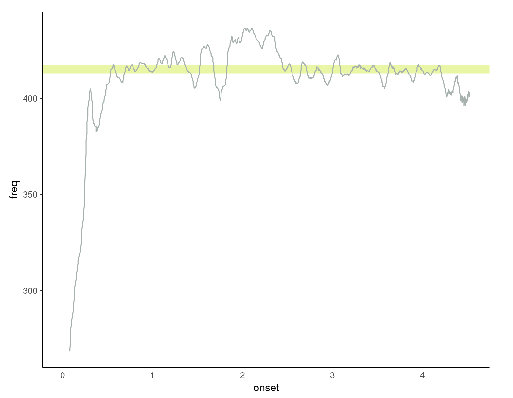
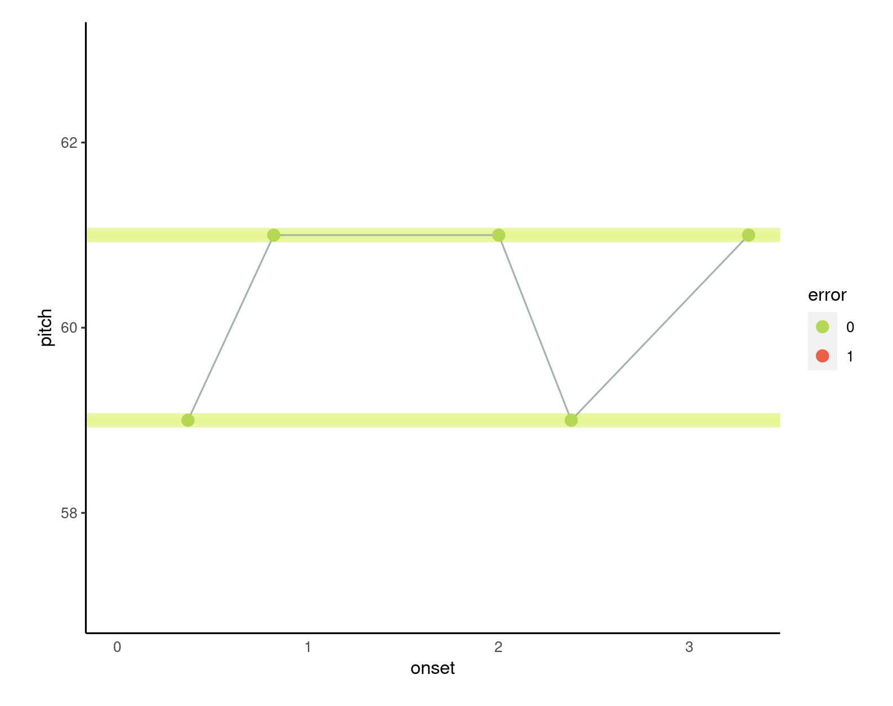
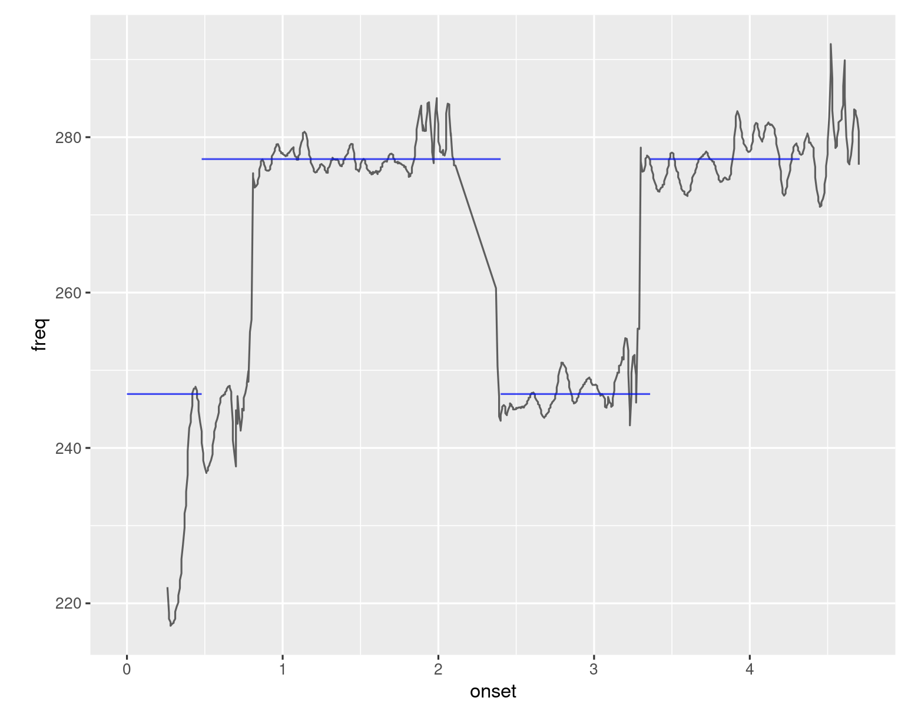

```{r include = FALSE}

library(tidyverse)
library(lme4)
library(corx)
library(corrplot)
library(readxl)
library(knitr)


pretty_comma <- function(n) {
  papaja::printnum(prettyNum(n,big.mark=",",scientific=FALSE, digits = 2))
}

options(scipen = 999)

```


It is almost too obvious to state: music must be produced to be perceived. Why then, 
have musical production tests, which capture enacted musical behaviours, been relatively underutilized compared to other forms of musical ability tests, which tend to focus on listening? Not only do perceptual musical ability tests disregard the participatory nature of music as an embodied activity [@lemanRoleEmbodimentPerception2014], they may also discard useful information about the internal representations of a research participant [@silasLearningRecallingMelodies2023]. In this way, it has recently been emphasised that understanding the production of music is crucial to understanding musical ability in general [@okadaWhatMusicalAbility2021; @silasLearningRecallingMelodies2023]. 

The general answer to the question we have posited is methodological: as outlined below, assessing produced musical behaviour in a meaningful way is a difficult problem. The purpose of the present paper is to document the development of an archetypal form of music production test: a singing test. In doing so, we utilise it to better understand musical ability and, in turn, provide useful tools for music education. In order to do this, we bring together different perspectives and computational tools developed over the last few decades into one open source, accessible framework. This should make music production research easier to conduct, and, consequently, help to understand musical abilities more comprehensively than before.

# Background

The main reason for the relative lack of studies of music production has been due to methodological limitations. Tests of music production are typically more difficult to implement and utilise for meaningful assessments of musical behaviour, mainly due to the problem of so-called "dirty (or messy) data" [@silasLearningRecallingMelodies2023; @mullensiefenSlobodaParkerRecall2011; @slobodaImmediateRecallMelodies1985]. The primary issue with such data is obtaining useful symbolic representations of sound and music from recorded audio files. However, thanks to advances in technology [e.g., @rasAdvancesMusicInformation2010], and the rise of open source software in general, it is now possible to measure produced musical behaviour in an objective and automated way, much more easily than before, and only contemporarily, across the internet.

Since much of the general population do not play musical instruments on a regular basis [@abrsmABRSMMakingMusic2022], but almost everyone has some degree of musical ability [@mullensiefenMusicalityNonmusiciansIndex2014; @honingOriginsMusicality2019], one inclusive way of assessing musical abilities in the general population is through the recording of singing. Research which employs singing, recorded as audio, as the main unit of analysis, generally has two separate strands in the research literature. In melodic recall research [@slobodaImmediateRecallMelodies1985; @mullensiefenSlobodaParkerRecall2011; @silasLearningRecallingMelodies2023; @ogawaModificationMusicalSchema1995; @ouraMemoryMelodiesSubjects1988; @zielinskaMemorisingTwoMelodies1992], singing is used as a test of memory for melodies and can help understand how such memory develops over time. Alternatively, singing accuracy research [@pfordresherImpreciseSingingWidespread2010; @pfordresherTheoreticalPerspectivesSinging2015; @russoRoutledgeCompanionInterdisciplinary2020; @tanEstablishingReliabilityValidity2021] is generally concerned with the ability to sing accurately and how such knowledge can help improve singing education.

However, research into melodic memory or singing accuracy is usually conducted in isolation, without much interchange of knowledge between these two research areas. Yet, this is curious considering that the two domains are fundamentally connected. It may not be immediately obvious, but, like many other issues in music psychology [@silasAssociationsMusicTraining2022], the causal relationships between singing ability and melodic memory can be argued in both opposing directions, depending on the perspective taken: a) lower-level singing abilities are required to sing pitches in tune, and hence, accurately demonstrate the melodic object held in memory (i.e., better singing produces a better melodic recall score) vs. b) in order to sing a melody well (or at all), one must be able to hold it in memory (i.e., better melodic memory produces better singing). Whilst b) is a plausible explanation from a cognitive perspective, from a data-driven and descriptive perspective, a) is important too, especially in the context of studying melodic memory, insofar as the ability of a participant to demonstrate their melodic memory is contingent on the accuracy of their singing. Consequently, we contend that, in order to understand melodic memory and/or singing accuracy well, both perspectives must be taken into account simultaneously. Furthermore, this should be the case with regards to both a testing framework and a supporting statistical modelling framework. We now briefly review the relatively disparate literatures in singing accuracy and melodic recall.


## Singing Accuracy

The singing accuracy literature [e.g., @cohenAIRSTestBattery2015; @pfordresherImpreciseSingingWidespread2010; @russoRoutledgeCompanionInterdisciplinary2020] is generally concerned with an individual’s ability to sing and what constitutes "good" singing. There have been several notable singing tests presented in the literature. The most well-known procedure is probably the *Seattle Singing Accuracy Protocol* [*SSAP*; @pfordresherTheoreticalPerspectivesSinging2015] which is "intended to be both brief and highly specific in its focus" with respect to singing measurement [@pfordresherConstructionValidationSeattle2020]. It is designed to measure how accurately one can reproduce musical pitches through singing, in the context of pitch-matching and also singing songs from memory. The procedure consists of participants completing the following tasks: i) vocal warmup tests comprised of singing a familiar song as well as a comfortable pitch, which is used to estimate a comfortable range for the participant to sing in; ii) singing 10 pitches in their vocal range in relation to a vocal example; iii) singing a further 10 pitches in relation to a piano tone; iv) imitating six 4-note melodies; and v) singing a well-known melody. The *SSAP* incorporates other perceptual tests and questionnaires as part of the battery too. However, it is not open source, and as far as we are aware, is unavailable.

Similarly, in the *Sung Performance Battery* [@berkowskaUncoveringPhenotypesPoorpitch2013], first an assessment of participants' vocal range is made, followed by five tasks: (i) single-pitch matching, (ii) pitch-interval matching, (iii) novel-melody matching, (iv) singing from memory of familiar melodies (with lyrics and on a syllable), and (v) singing of familiar melodies (with lyrics and on a syllable) at a slow tempo indicated by a metronome. Likewise, the *AIRS Test Battery of Singing Skills* (*ATBSS*) [@cohenPerformanceCanadiansAutomated2020; @cohenAIRSTestBattery2015] measures the following abilities, to: i) sing internationally familiar songs (Brother John, Frère Jacques) as well as learn a new song; ii) perform short melodic fragments; iii) sing lowest and highest notes; iv) improvise the ending of a song, and v) create an entirely new song. In addition, several verbal recall tasks are included^[Note that the *Singing Ability Assessment* test presented in this paper has already been adapted to work in the context of the *AIRS* battery [@gallantKnowledgePopularMusic2022] ]. 

More recently, and particularly relevant to our research, @tanEstablishingReliabilityValidity2021 assessed a singing task's validity and reliability in an online setting. This procedure included: i) singing *Happy Birthday*; ii) matching 5 notes and iii) singing unfamiliar 7-note melodies as well as including additional perceptual tests and questionnaires. Very recently, and innovately, large scale singing research has been also conducted online outside of the context of Western music [@anglada-tortStudyingEffectOral2022]. @anglada-tortStudyingEffectOral2022's approach also uses automated scoring and an online testing environment, with the main task being to sing back short melodies as immediate recalls. 

There is much overlap between the task procedures described above: single-note singing, familiar song singing and melodic singing. The tasks we describe here share some similarities (e.g., single note singing, melodic items), but have some differences. For instance, whilst possible in our framework, we do not ask participants to sing a familiar song in our default procedures. We also use a substantially larger and much more heterogeneous database of melodic items, from which we randomly sample, within constraints (e.g., a given melody length). These choices to maximise item feature variance reflect our interest in connecting melodic features to task performance via item response theory [@deboeckExplanatoryItemResponse2016].

An important point to note is the fact that singing accuracy research is more concerned with fine-grained pitch control compared to melodic memory research, which is about understanding high-level melodic mental representations. But even singing accuracy appears to comprise two slightly disparate skills: accuracy (proximity to a target) and precision (consistency of reproduction) [@pfordresherImpreciseSingingWidespread2010]. This highlights the need to not only measure singing accuracy and melodic memory via sung recall simultaneously, but also several constructs related to singing accuracy simultaneously.

## Melodic Recall

In contrast to singing accuracy tests, the *melodic recall paradigm* was designed as a test of melodic memory, with the most cited early example being @slobodaImmediateRecallMelodies1985. The melodic recall paradigm is used to make inferences about melodic memory, its errors, and how melodic representations build up over time [@mullensiefenSlobodaParkerRecall2011; @silasLearningRecallingMelodies2023]. It does not usually include specific metrics related to singing accuracy. There have been several studies using this paradigm as a melodic memory test (e.g., @silasLearningRecallingMelodies2023; @ogawaModificationMusicalSchema1995; @ouraMemoryMelodiesSubjects1988; @zielinskaMemorisingTwoMelodies1992) and several insights can be drawn from this research: 1) when learning a melody, harmony may be extracted more readily than rhythm or interval information (at least for participants with a substantial amount of prior musical training); 2) over successive attempts, participants store more notes in memory and try to recall more on each attempt; 3) participants generally get better at singing melodies over multiple attempts [@silasLearningRecallingMelodies2023].


##  "Dirty" Musical Data and Similarity Assessment

Despite the importance of produced actions in musical behaviour, there is a relative dearth of research investigating musical recall and production compared to studies using purely perceptual paradigms to investigate melodic processing (e.g., @idsonBidimensionalModelPitch1978; @dowlingContourIntervalPitch1971). One proposed reason for the scarcity of melodic recall studies is that melodic production data is relatively "dirty" (i.e., not easy to clean and analyse) and difficult to model [@mullensiefenSlobodaParkerRecall2011] since it requires the  transcription a recorded signal to a symbolic representation (e.g. musical notation or numerical representations) from audio files. However, thankfully, in recent years, much progress has been made in this domain [@kimCrepeConvolutionalRepresentation2018; @mauchPYINFundamentalFrequency2014]. 

As originally conveyed by @slobodaImmediateRecallMelodies1985, and more recently articulated by @mullensiefenSlobodaParkerRecall2011, so-called "dirty" data usually requires "expert interpretation. Participants are required to sing, and their singing may be inaccurate; in some places, it is necessary to infer which note(s) they meant to sing. The participants’ singing is recorded, and it is possible that the recording may be imperfect". Such imperfect singing is also surely related to the amount of effort expended by a participant, a perennial issue for performance research in general [@silmRelationshipPerformanceTesttaking2020]. The issue of effort and motivation affecting performance outcomes is very difficult, or impossible, to entirely mitigate, especially in the context of online research.

Furthermore, issues beyond audio transcription arise, once symbolic representations have been created: how should somebody's recall be assessed with respect to a target melody, especially when sung recalls may greatly differ in length from the target melody for comparison [@mullensiefenSlobodaParkerRecall2011; @silasLearningRecallingMelodies2023]? To approach this issue, @mullensiefenSlobodaParkerRecall2011 and @silasLearningRecallingMelodies2023 utilised a computational approach which quantified sung recall performance in terms of a melodic similarity metric, providing a more objective and transparent approach than the prior approach of using human judgements to assess the similarity between target melody and (imperfect) recalls, or utilising accuracy measures [@slobodaImmediateRecallMelodies1985], which are inadequate [@silasLearningRecallingMelodies2023]. Likewise, as articulated in detail in Experiment 2, we propose the *opti3* melodic similarity metric [@mullensiefenCognitiveAdequacyMeasurement2004] as being a suitable metric for scoring melodic sung recall data. 

In addition, our framework mitigates the impact of dirty data early in the stage of data collection through several features of the online data test interface, such as real-time signal-to-noise (*SNR*) measurement of a participant’s environment, to triage participants with noisy rooms, as well as transposing stimuli into the computed singing range of a participant, to ensure their ability is not underestimated by presenting out-of-range stimuli. See Table 11 for a list of technical and procedural features for reducing noise in the collection of singing data online.


# Integrating Singing Accuracy and Melodic Recall 

To integrate singing accuracy and melodic recall perspectives, @pfordresherTheoreticalPerspectivesSinging2015's cognitive model of singing accuracy provides a useful framework for understanding accurate singing and melodic production. At the low-level, this model comprises an auditory feedback loop. In this loop, first, external auditory input is processed as low-level perceptual representations of sound (pitch, duration, timbre, loudness). Such low-level representations are used as input to a translation model which relates auditory input to sensorimotor action that is relevant to singing. Hence, this enables the guidance of a singer's sensorimotor plans to adjust their singing (e.g., to be in tune), in response to auditory feedback. Such changes in sensorimotor actions comprise physical processes like respiration, phonation and articulation. The lower-level auditory representations are also used as input to higher levels of cognition which hold mental templates about music (e.g its features, such as its tonality), stored in long-term memory [@baddeleyMemory2009]. These templates allow auditory content to be categorised, forming more sophisticated representations of it, taking on musical domains such as representations of (melodic) features like tonality and contour, as well as segmenting melodies into coherent perceptual chunks. These formed higher level representations can in turn be used as input back to the lower level auditory feedback loop and further inform sensorimotor planning. Hence, the overall architecture of Pfordresher et al. (2015)’s cognitive model is bidirectional: both "top down" and "bottom up". Altogether, this system enables a singer to fulfill objectives related to sung recall (i.e., hearing stimuli, representing its musical features mentally, responding through singing, and adjusting behaviour to fulfill the goal sufficiently).


Our focus in the current paper is on the higher level aspects: memory for melodic representations. However, we also simultaneously seek to take lower-level singing accuracy into account. In this way, we aim to draw the literature from both research areas described above and integrate them comprehensively, as @pfordresherTheoreticalPerspectivesSinging2015's model suggests. To meet this objective formally, we invoke item response theory [@deboeckExplanatoryItemResponse2016] as a psychometric modelling framework.


## Cognitive Modelling via Item Response Theory

Performance on an ability test can vary as a function of individual differences (i.e., some participants have a higher ability than others), but also as a function of items themselves (i.e., some items may be more difficult than others). In our study, there are two broad trial types: single long note singing and melodic singing. If long notes are presented in the vocal range of a participant (as we do here), the "item" effect of long notes are not expected to be important. That is: certain single pitches do not have properties which make them more or less difficult to sing than others.

Conversely, for melodic items with multiple notes, musical features emerge (e.g., tonality, contour, rhythm). Such emergent features clearly rely on high-level mental representations and templates (i.e., musical knowledge). Consequently, there can be significant variance in complexity when a melody is the item of testing, and these kind of item difficulties are important to model. Important melodic representations can be quantified for each melodic item across important dimensions [@mullensiefenFANTASTICFeatureANalysis2009]. As suggested by previous literature [@bakerModelingMelodicDictation2019; @dreyfusRecognitionLeitmotivesRichard2016; @harrisonModellingMelodicDiscrimination2016], there are several melodic features which could indicate an item's complexity and predict singing performance (e.g., tonality, interval contour, a melody's frequency in occurrence).

In order to formally relate structural features of melodies to the cognitive difficulty of melody processing, the main methodological approach we utilise here is *explanatory item-response theory* (*IRT*; @deboeckExplanatoryItemResponse2016). In this paper, *IRT* can be considered our first level of modelling, where melodic features become predictors of the *opti3* similarity score, which we take as representing variance in both singing accuracy and melodic memory. *IRT* is useful for our enquiry since it allows the simultaneous modelling of item difficulties and individual differences together via mixed effects modelling, whilst compartmentalising the variance into fixed item effects (melodic features), random item effects (unexplained effects due to melodic items) and participant effects (effects due to individual participants' abilities). Additionally, an *IRT* model can be the basis of creating an adaptive test, which is highly efficient and can be variable in test length, since encoding relationships between item features and performance can be used to generate or select items based on modeled difficulties [for similar approaches see @geldingEfficientAdaptiveTest2021; @harrisonApplyingModernPsychometric2017; @harrisonDevelopmentValidationComputerised2018; @harrisonModellingMelodicDiscrimination2016; @tsigemanJackJillAdaptive2022]. Such an adaptive test can hence be employed flexibly, with potential applications in education.

In this paper, our strategy to relate singing accuracy to melodic memory is to extract participant and item level scores from our *IRT* mixed effects models and use these outputs in further modelling. For instance, we use participant-level scores to represent individual differences in overall melodic memory and singing ability, and participant level indicators of singing accuracy alone (comprising e.g., single long note singing, singing accuracy, precision), to predict such outputs. This allows us to evaluate the potential extent that low-level singing abilities are responsible for the overall variance in singing performance, leaving the rest to do with variance in melodic memory, or being unexplained.


# Motivations

The research presented here offers a two-fold contribution to the research literature, in both terms of: 1) general accessibility and 2) methodological advances.

## An Accessible Open Source Framework

Whilst developed literatures already exist regarding melodic recall [@slobodaImmediateRecallMelodies1985; @mullensiefenSlobodaParkerRecall2011; @silasLearningRecallingMelodies2023] and singing accuracy [@cohenAIRSTestBattery2015; @pfordresherImpreciseSingingWidespread2010; @russoRoutledgeCompanionInterdisciplinary2020], and there are several previous singing tests described in the literature [e.g., @pfordresherConstructionValidationSeattle2020; @tanEstablishingReliabilityValidity2021], we do not know of a transparent and flexible open-source framework which enables researchers to easily access and implement a singing test themselves, enabling laboratory and online data collection for several simple singing tasks, such as sustaining long notes and imitating melodies. The main contribution of the present research is simply to make such a tool accessible to a wider audience and remove the black box element that masks many described singing paradigms in the literature. This can be considered an important step towards the standardisation of singing tests.

## Methodological Advances in Sung Recall Research

In terms of more sophisticated usage, and advancing previous methodologies and theoretical insights, like other innovative recent research [@anglada-tortStudyingEffectOral2022; @jacobyUniversalNonuniversalFeatures2019], our test framework and approach also makes a number of important contributions beyond its accessibility. These are to: a) enable the automatic filtering of participants based on background noise at the beginning of a test; b) present stimuli based on the participant's empirically determined vocal range; c) support multiple languages^[At the time of writing, our test has been translated into German, Italian and Latvian, in addition to English.]; d) comprehensively integrate melodic recall and singing accuracy frameworks to assess both low-level singing ability and high-level melodic memory ability simultaneously; e) allow easy implementation in a timeline together with other behavioural tests; f) be readily usable with new item banks of melodic stimuli^[These can be created with the *itembankr* *R* package from *.mid* files, *.musicxml* files or a dataframe of melody pitches and frequencies. See: https://github.com/sebsilas/itembankr.], g) be able to provide real-time feedback for possible extensions to educational settings, h) be supported by statistical models which connect relevant melodic recall and singing accuracy variables to one another, at both the trial level and beyond, and to do so, i) be based on item response theory [*IRT*; @deboeckExplanatoryItemResponse2016] as a statistical modelling framework, which allows us to construct a computerised adaptive [@harrisonPmcharrisonPsychTestRCATPsychTestRCAT2018] version of the test that can be extended to educational settings.

In turn, we hope that the framework's accessibility and methodological advances will go hand-in-hand, and stimulate the solving of more complicated issues in sung recall research, such as improving the quality of sung audio transcription. Having an open source infrastructure in place enables researchers to start from the principle of tackling such issues from the outset, without the large startup cost of implementing singing technology in the first place.

# The Present Study

Hence, the main objective of this research was to draw upon the literatures in melodic recall and singing accuracy and build a new, easily accessible computational ecosystem for conducting melodic recall and singing research simultaneously (or in isolation, if desired). We also provide detailed documentation on how to access, utilise and adapt the software with reference to web documentation^[https://saa.musicassessr.com/]. Moreover, in the spirit of open science, the framework is completely open source, and hence transparent; it additionally has the flexibility to be adapted (e.g., to score sung recall data with new custom measures) by being constructed in a modular way, allowing new research ideas to be taken forward more easily than before.

To that end, we designed a test, and complementary open source testing environment of sung recall, which we called the *Singing Ability Assessment* (*SAA*). The protocol incorporate three sets of procedures and underlying statistical models which reflect 1) single long note singing ability, 2) rhythmic melodies singing ability, and 3) arhythmic melodies singing ability as separate trial blocks. These are realised in five key open source *R* packages: 1) *pyin*^[https://github.com/sebsilas/pyin], which wraps the *pYIN* [@mauchPYINFundamentalFrequency2014] and *Sonic Annotator* [@cannamLinkedDataYou2010] libraries in *R*, enabling fundamental frequency and note onset estimation computation within the *R* environment (using *pYIN*); 2) *musicassessr*^[https://github.com/sebsilas/musicassessr], a general environment for deploying musical stimuli and collecting musical data in *psychTestR* [@harrisonPsychTestRPackageDesigning2020], especially for scoring melodic production and singing data^[The scoring functionality can work both in a real-time test as well as in batch-mode after audio recordings have been made.]; 3) *itembankr*^[https://github.com/sebsilas/itembankr] for creating useful item banks of melodic stimuli for use with *musicassessr*/*psychTestR*; 4) *Berkowitz*^[https://github.com/sebsilas/Berkowitz], an item bank of melodies from @berkowitzNewApproachSight2017 (see also @bakerMeloSolCorpus2021) as outputted by *itembankr*, that can be used in *musicassessr* tests and 5) the *Singing Ability Assessment* (*SAA*) test package^[https://github.com/sebsilas/SAA] which brings everything together and allows for the comprehensive, yet efficient, collection of singing data. We invite collaborators to explore and contribute to these open source packages.

Across two experiments, we describe the development of the *Singing Ability Assessment* (*SAA*). Experiment 1 describes a preliminary "rehearsal" paradigm for testing melodic singing, validated alongside other measures of musical and non-musical abilities. Experiment 2 describes updates to the protocol which utilise a new paradigm (the "one-shot" paradigm) and allow all scoring to be done on-the-fly. Moreover, we also validate the new singing test alongside other measures of singing accuracy described in the literature, and hence, formally associate singing accuracy and melodic recall variables together. Both experiments result in item response theory  (*IRT*; @deboeckExplanatoryItemResponse2016) models to support the paradigms.


\newpage

# Experiment 1: Design, development of and calibration of the Singing Ability Assessment (SAA) task


```{r child = "experiment_1.Rmd"}

```


\newpage 

# Experiment 2: Validation of the SAA "one-shot" paradigm


```{r child = "experiment_2.Rmd"}

```


# General Discussion

Across two experiments, this paper described the development of an open source infrastructure for testing sung recall. It employed ideas and approaches from both melodic memory [e.g., @slobodaImmediateRecallMelodies1985] and singing accuracy [e.g., @pfordresherTheoreticalPerspectivesSinging2015] perspectives, and hence, is able to facilitate research in both fields. The testing infrastructure builds upon existing routines for the measurement of musical abilities which are often limited to perceptual tests. Here, we offer a solution for extending research to musical production paradigms. This is extremely important to the future of musical testing: as recently conveyed by @okadaWhatMusicalAbility2021, among others [@burenWhatMakesChild2021; @hallamMusicEducation21st2010; @silasLearningRecallingMelodies2023], musical ability is not completely represented without testing musical production.

The work presented here provides a framework which allows a wide range of methods to score singing data with a battery of various measures, both new as well as previously described in the literature. The functionality enables researchers to create large item banks of melodic stimuli which are rich in features relevant to psychological processes, and sample from them in useful ways (e.g., to place them in the range of a singer whilst fulfilling other testing constraints). This is highly consequential for psychological testing since it allows researchers to connect relevant melodic features to task performance whilst maximising heterogeneity and variance in the collected data, which is otherwise constrained by small item pools, which do not properly reflect the full variance in musical data. Our work also provides processes to maximise quality control, especially in online settings, which helps mitigate the occurrence of "dirty data" [@mullensiefenSlobodaParkerRecall2011] in the first place. For instance, our analysis pipeline suggests that there is no difference between a user using an internal vs. an external microphone (see Appendix D), which suggests our audio transcription is relatively robust, once certain constraints have been fulfilled (e.g., a certain *SNR*).

In the spirit of open-source software, this framework is openly available for use, and we encourage others to contribute to it. We emphasise the flexibility of the framework to be adapted in different settings, as has already been done [@gallantKnowledgePopularMusic2022]. In this way, the growing web documentation^[https://saa.musicassessr.com/articles] demonstrates how it is relatively easy to include new singing procedures (e.g., asking a participant to sing Happy Birthday) or add new scoring features into the analysis pipeline (i.e., taking the *pYIN* fundamental frequency and note onset information and score it via the *additional_scoring_measures* argument to the *SAA* test function), ultimately enabling researchers to test new hypotheses. There are also examples which show how the *SAA* can be included alongside other ability tests in a single timeline.


Beyond the methodological and theoretical contributions for music psychology, this research also has implications for the automatic assessment of musical performance [@abesserAutomaticCompetencyAssessment2014; @abesserAutomaticQualityAssessment2013; @dittmarAutomaticSingingAssessment2012; @kniggeModellbasierteEntwicklungUnd2010], which is becoming important in music education. In this context, tests of music production are designed to assess the musical production competences of students in schools, which can more objectively inform teachers of the ability level of students in their class, as well as provide the basis for specific teaching interventions. This is the eventual end goal of the current research agenda. We hope to support the wide interest in developing singing skills with the help of technology within academic settings, in a more open way than popular, but closed-source counterparts [e.g., @SingStar2022; @SmuleSingRecord2022; @VoCoVocalCoach2022]. More broadly, we view adaptive testing as a step into tailored education via technology. Such education is not sufficient to serve the full range of musical experience, but it can certainly be very powerful when used as an educational tool. 


The *SAA* is currently available for use here: *https://saa.musicassessr.com*. The code to produce this manuscript and analyses can be found here:  *https://github.com/sebsilas/SAA_Paper_2022*. An online demo can be found here: *https://adaptiveeartraining.com/SAA-demo*. Table 11 lists the current features of the *SAA*. See Figures 2, 3 and 4 for examples of feedback produced by the *SAA*. 

\newpage

```{r}

table_1 <- tibble(Feature = c(
  "Real-time fundamental frequency estimation and note onset detection", 
"Real-time scoring with several different measures of singing ability", 
"Triage participants based on their signal-to-noise at beginning of test", 
"Collect a user's vocal range and present stimuli to that range at test time", 
"Use of multiple item banks", 
"Item response theory-based modelling", 
"Computerised adaptive testing", 
"Optional performance feedback, including musical notation  and audio feedback in the browser", 
"Deploy easily alongside other ability tests", 
"Suitable for online or in-person data collection", 
"Scalable online server support via Amazon Web Services", 
"Control test length (number of items) and constrain item features", 
"Control melody sound (i.e., piano, tone, guitar)", 
"Parameters to select different paradigms (e.g., arrhythmic, rhythmic) and number of attempts per melody", 
"Relative ease to extend the battery with new scoring functions",
"Internalisation (currently translated into German and Italian in addition to English)"))

table_1 %>% 
  knitr::kable(caption = "Summary of the Singing Ability Assessment's features")

```


```{r fig.cap = 'Examples of real data produced by the Singing Ability Assessment (SAA): long note singing feedback'}



```

```{r fig.cap = 'Examples of real data produced by the Singing Ability Assessment (SAA): Melodic singing feedback; yellow green lines represent target pitches, green points correctly sung notes, red points incorrectly sung notes.'}


  

```

```{r fig.cap = 'An alternative representation of melodic singing: the sung recall frequency curve in relation to target pitches (solid rectangles). In this case, the participant has sung a good approximation of the target pitches. Such a comparison of representations is the basis of the dynamic time warping distance measure we use. Note: the solid rectangles do not represent extracted onsets/pitches, but the target notes.'}



  

```

# Limitations

Our study has a number of limitations, some of which we will address in forthcoming research (we remind the reader the the *SAA* is in continual development). First, our modelling approach is by no means the only way of relating melodic recall and singing accuracy variables to one another: there are many other possible frameworks and approaches. One of our main interests is in how other researchers will use the framework published here to further new modelling ideas. In particular, we are interested in employing structural equation modelling to more comprehensively relate our variable sets together. Second, our statistical modeling only applies to Western music. A future direction of this type of framework might be to extend it to different musical systems. We point readers to the other very innovative research in this regard [see @anglada-tortStudyingEffectOral2022; @jacobyUniversalNonuniversalFeatures2019]. Third, we have not attempted to remove acoustic artifacts, or explored various audio manipulations before analysis. In one sense, this hands-off approach is a benefit: employing certain audio manipulation steps might introduce new artifacts in the process of removing others. However, we are keen to explore the audio cleaning steps taken in @anglada-tortStudyingEffectOral2022 with our data, to see how this may be able to improve our own analysis pipeline. We have already begun conducting such experiments, which we intend to present in a forthcoming paper, briefly suggested in the following section.


## Future Directions

In future work we aim to fully develop and implement an adaptive singing ability assessment (*aSAA*) test ^[However, readers can already view and explore a prototype here: *https://adaptiveeartraining.com/aSAA*.]. This requires several new features and mechanisms, including the on-the-fly estimation of a participant’s singing ability and the enhancement of several components of the *SAA*. This may include the optimization of *opti3* as dependent variable to work better for singing data, and similarly, the parametric optimisation of the *pYIN* fundamental frequency estimation algorithm for singing data. In addition, the participant’s ability to sing useable long notes could be tested more thoroughly at the beginning of the *SAA* test protocol in order to triage participants early in the test which will further maximise data quality and save participant’s time. Since, as documented commonly in performance research [@silmRelationshipPerformanceTesttaking2020], and suggested in Experiment 2 of our paper, whereby not many participants optionally took more than one attempt at the same melody, any measures to improve participant effort will be valuable to the *SAA*. This is a main purpose of adaptive tests: shorter tests can maximise effort (e.g., with fewer trials, participants may be more likely to have more attempts at each trial). However, in parallel to the *SAA* development, we have also been exploring how we can make our tests more aesthetically engaging and maximise motivation [@silasGamifyingMusicalListening2023], which we plan to extend to the *SAA* for future data collections. Finally, the new adaptive *SAA* will need to be validated and robust psychometric benchmarks will need to be derived from a large sample of participants of all singing abilities. Much in parallel, we are also developing the assessment procedures described above further in the context of data collected from people playing musical instruments, with the objective of eventually facilitating reliable real-time assessment and tailored music education [@silasWhatMakesPlaying2021].


\newpage

# References

::: {#refs custom-style="Bibliography"}
:::


\newpage

# Appendices


```{r child = "appendix.Rmd"}

```
