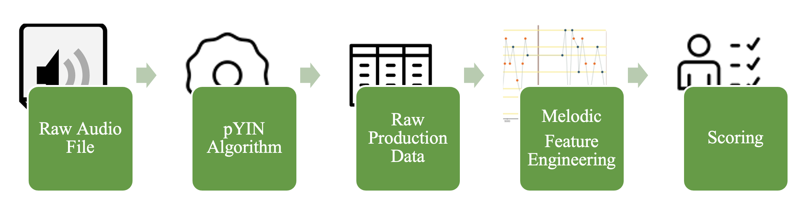

```{r}

exp_1_data <- read_csv('../data/exp1/main_data.csv') %>% 
  dplyr::rename(opti3 = opti3_scores, N = length)

```


```{r}

load('../data/exp1/checkpoint1.RData')

exp1_prod <- dat

rm(dat)

```


```{r}

# Estimate how many participants selected the correct range

soprano <- 60:84
alto <- 53:77
tenor <- 48:72
baritone <- 45:69
bass <- 40:64

vocal_ranges <- list("Soprano" = soprano,
                     "Alto" = alto,
                     "Tenor" = tenor,
                     "Baritone" = baritone,
                     "Bass" = bass)

mean_vocal_ranges <- lapply(vocal_ranges, mean)

vocal_df <- tibble::tibble(
  Range = names(vocal_ranges),
  Mean_Range = unlist(mean_vocal_ranges)
)

get_closest_range <- function(n) {
  vocal_df %>% 
    slice(which.min(abs(Mean_Range - n))) %>% 
    pull(Range)
}

# get_closest_range(60)

```


```{r, warning = FALSE}

exp1_participant_ranges <- exp1_prod %>% 
  select(find_user_range, prod, p_id) %>% 
  rowwise() %>% 
  mutate(mean_pitch = 
          mean(prod %>% pull(pitch), na.rm = TRUE)
         ) %>% 
  ungroup() %>% 
  group_by(p_id) %>% 
  summarise(range = find_user_range,
            mean_pitch = mean(mean_pitch, na.rm = TRUE)) %>% 
  ungroup() %>% 
  unique() %>% 
  rowwise() %>% 
  mutate(Predicted_Range = get_closest_range(mean_pitch)) %>% 
  ungroup() %>% 
  mutate(Correct = Predicted_Range == range)


pr_cr_range <- 
  round((sum(exp1_participant_ranges$Correct, na.rm = TRUE)/nrow(exp1_participant_ranges))*100, 2)

```

In Experiment 1, we aimed to design a new test for capturing sung recall. We wanted the task to share a seamless integration with statistical modelling packages (such as those which implement item response theory approaches) as well as other musical ability tests. In this regard, the *psychTestR* [@harrisonPmcharrisonPsychTestRCATPsychTestRCAT2018; @harrisonPsychTestRPackageDesigning2020] framework in the *Shiny* [@changShinyWebApplication2019] and *R* [@rcoreteamLanguageEnvironmentStatistical2020] environments was ideal, since many statistical tools and validated musical and non-musical ability tests are now implemented in this framework^[See https://shiny.gold-msi.org/longgold_demo/ and https://testing.musikpsychologie.de/dots_home/].

After developing the new *SAA* task, Experiment 1 seeks to validate the *SAA* via the construction of  an explanatory IRT model, which is a special case of a general linear mixed effect model [see @harrisonDevelopmentValidationComputerised2018 and @boeckEstimationItemResponse2011 for detailed information about this approach]. As a means of determining construct validity, we then sought to correlate its derived ability score with other previously validated ability tests, described below.


## Hypotheses

Performance on the *SAA* was hypothesised to be predicted by structural features of the melodic stimuli which indicate melodic complexity (e.g tonality and interval contour; see @dreyfusRecognitionLeitmotivesRichard2016, @defleurianInformationtheoreticMeasuresPredict2017 and @mullensiefenRoleFeaturesContext2014 for similar approaches).

Secondly, in addition to structural features of melodies, we hypothesised that performance on our new test would also be related to individual difference scores on other questionnaires/tests of related musical and non-musical abilities, in line with @pfordresherTheoreticalPerspectivesSinging2015's model and the other literature reviewed above. These were measures of: working memory capacity [@tsigemanJackJillAdaptive2022], pitch discrimination [a *psychTestR* re-implementation of @soranzoPsychoacousticsComprehensiveMatlab2014], mistuning perception [@larrouy-maestriMistuningPerceptionTest2019], melodic discrimination [@harrisonModellingMelodicDiscrimination2016] and pitch imagery [@geldingEfficientAdaptiveTest2021]. Relationships of our derived *SAA* score with these other indicators would offer concurrent validity to the novel task.


# Method

# Participants

```{r}

exp1_dem <- read_csv('../data/exp1/full_age_gender_demographics.csv')

exp1_tot_p_with_dem_data <- nrow(exp1_dem)
  
exp1_gender_count <- exp1_dem %>% 
  count(demographics.gender) 

exp1_no_female <- exp1_gender_count %>% 
  filter(demographics.gender == "Female") %>% 
  pull(n)

```

247 participants aged `r min(exp1_dem$demographics.age)`-`r max(exp1_dem$demographics.age)` (*M* = `r round(mean(exp1_dem$demographics.age), 2)`, *SD* = `r round(sd(exp1_dem$demographics.age), 2)`; 60% Female; 3 = "Other"; 1 = "Prefer not to say" and 10 missing, reason unknown) were recruited through social media and the marketing panel *SliceThePie*^[https://www.slicethepie.com/]. A subset of 72 of these participants completed an extended procedure with several more tests (described below) than the main sample.

# Materials

# Singing Ability Assessment (SAA)

We extended *psychTestR*’s capabilities by adding in-browser audio recording functionality and on-the-fly in-browser melody playback [@ToneJs2020]. The task was deployed on an *Amazon EC2*^[https://aws.amazon.com/ec2/] server instance which hosted a Shiny server^[https://www.rstudio.com/products/shiny/shiny-server/] environment. Participant response was recorded as audio in the internet browser and sent to an *Amazon S3*^[https://aws.amazon.com/s3/] media storage bucket, where it was later downloaded for analysis^[Note that the S3 bucket approach was eventually discontinued.]. Utilising browser feature detection [@ModernizrFeatureDetection2020], users whose browsers did not support the necessary features (e.g., the "MediaRecorder" browser feature) were not allowed to enter the test. Participants were given an opportunity to test their microphone and headphones. They selected a vocal range that best matched their voice with reference to audio examples (*Soprano*, *Alto*, *Tenor*, *Bass*, *Baritone*). This range was used to present stimuli according to the selected range. Post-hoc, we estimated that at least `r pr_cr_range`% of participants selected an appropriate range, based on matching the mean note they sang across all trials to the closest mean note of the different vocal ranges. This estimate is likely a lower bound, since vocal ranges somewhat overlap, and the mean singing note computed from trials is also dependent on the randomly selected melodies a participant heard.


## Melodic stimuli set: The Berkowitz Corpus

Stimuli deployed by the *SAA* were drawn from @berkowitzNewApproachSight2017 [see also @bakerMeloSolCorpus2021], a corpus of melodies designed to improve sight-singing (singing from musical notation). The book consists of a collection of itemised melodic sequences. We took the first 629 sequences in the book and split them into N-grams^[An N-gram is a contiguous subset of a sequence (e.g., "ABIL" is an N-gram of "SINGINGABILITY")] of length 3 to 15. Based on evidence from the perceptual literature [@pembrookEffectVocalizationMelodic1987], we assumed 15 notes to cover the upper bound for short-term memory span of unknown melodies. We then removed any duplicate N-grams, resulting in a stimulus item bank of 159,127 unique N-grams.

# Other tests and questionnaires

We now list the other tests and questionnaires utilised. To to save space in the present manuscript, we keep the descriptions relatively brief, and encourage the reader to refer to the corresponding publications for more details. Some of the tests are adaptive. We refer the reader to Appendix A to see the reliability for the adaptive tests at the respective length we chose. Several have been comprehensively validated with respect to the item lengths we use (see @liuLanguageExperiencePredicts2023).


## Goldsmiths Musical Sophistication Index (Gold-MSI; @mullensiefenMusicalityNonmusiciansIndex2014). 

The *Goldsmiths Musical Sophistication Index* [*Gold-MSI*; @mullensiefenMusicalityNonmusiciansIndex2014] is a self-report inventory for assessing dimensions of musicality in the general population. It was utilised here to produce scores of both musical training and singing abilities, based upon the *Gold-MSI*'s corresponding subscales of the same names, each comprising seven items ^[Note that subjective self-reports of singing ability are a different kind of measure of singing ability to the objective measurement and computational approach taken in this paper. Yet, it is a clear target to obtain construct validity.]. Higher amounts of musical training are hypothesised to be positively correlated with ability in singing, either because musical training facilitates the direct development of singing as a skill and/or the musicianship skills acquired through training (e.g., music theory, playing by ear) support the memory of musical content, such as melodies. Alternatively, those with more natural talent may be predisposed towards undertaking musical training, also producing a positive correlation (see @silasAssociationsMusicTraining2022).


## Melodic Discrimination Test (MDT)

Melodic discrimination ability was assessed using the adaptive *Melodic Discrimination Test* [*MDT*; @harrisonApplyingModernPsychometric2017]. The test uses a 3-AFC response paradigm, with each item consisting of three versions of a melody played at different transpositions in pitch (for example: first: D major, second: Eb major, third: E major). Two of these versions are always identical and one is always different. The participant must identify the nonidentical melody, but ignore transpositions between versions. The ability to perceive and remember melodies well should serve as a predictor of our sung recall task, since to sing back melodies, one must first be able to remember them. Hence, better melodic discrimination ability should predict better sung recall performance. The version of the *MDT* used in this study comprised 11 items using an adaptive procedure [@harrisonApplyingModernPsychometric2017]. IRT scores for the MDT task were generated online using the R package psychTestRCAT v1.0.2 [@harrisonPmcharrisonPsychTestRCATPsychTestRCAT2018] according to the underlying IRT model described in [@harrisonApplyingModernPsychometric2017]. The test utilised an adaptive procedure which adjusted to the ability of a participant based on a *psychTestRCAT* [@harrisonPmcharrisonPsychTestRCATPsychTestRCAT2018] implementation.

## Pitch Imagery Arrow Task (PIAT)

The *Pitch Imagery Arrow Task* (*PIAT*) has been established as a valid and reliable measure of musical imagery, the ability to mentally represent and transform pitch [@geldingEfficientAdaptiveTest2021]. Participants must imagine going up and down a scale in relation to up and down arrows. They indicate whether their imagined tone was the same as a probe tone played at the end of a trial. A correct response requires identifying the correct place to end up in the scale based on the arrow indications. The ability to imagine musical content is a necessary component of sung recall. If one cannot imagine a melody they have heard after perceiving it, they will not be able to reproduce it. Hence, better pitch imagery ability should predict better singing performance. The task was adaptive with IRT scores for the PIAT task being generated online using the R package *psychTestRCAT* v1.0.2 [@harrisonPmcharrisonPsychTestRCATPsychTestRCAT2018] according to the an underlying explanatory IRT model [@geldingEfficientAdaptiveTest2021]. There were 15 items. The test utilised an adaptive procedure which adjusted to the ability of a participant based on a *psychTestRCAT* [@harrisonPmcharrisonPsychTestRCATPsychTestRCAT2018] implementation.


## Pitch Discrimination Complex Tone Task (PDCT)

In a pitch discrimination complex tone task^["Complex" refers to the nature of the tone, which contains harmonics, rather than being a "simple" sine tone, which contains no harmonics.], participants must discriminate the odd-one-out of a series of tones. There is a reference tone at a given audio frequency (here, 330 Hz), which may be at any point in the sequence, and other tones deviate from this frequency by varying amounts, with tones being closer to the reference tone being more difficult to detect. This perceptual pitch discrimination ability is a necessary part of the feedback mechanism to guide singing to be more or less in tune with target pitches, and hence, better pitch discrimination ability should predict singing ability. We re-implemented a complex pitch tone discrimination task with a 3-alternative forced choice (3-AFC) "odd-one-out" procedure like that described in @soranzoPsychoacousticsComprehensiveMatlab2014, but in the *psychTestR* environment^[Accessible here: https://github.com/sebsilas/PDT]. The task was adaptive, and derived based on an IRT model we constructed using previously collected 3-AFC pitch discrimination data. There were 15 items. The test utilised an adaptive procedure which adjusted to the ability of a participant based on a *psychTestRCAT* [@harrisonPmcharrisonPsychTestRCATPsychTestRCAT2018] implementation.

## Mistuning Perception Test (MPT)

*The Mistuning Perception Test* [*MPT*; @larrouy-maestriMistuningPerceptionTest2019] is designed to assess whether a participant has the ability to detect whether a vocalist is singing "in-tune" against an audio track. Under a 3-AFC paradigm, participants must indicate which of three recordings contained an out-of-tune vocalist singing. The task of detecting whether a singer is in tune shows clear similarities to the task of monitoring one's own singing and whether it is in tune. Hence, it is predicted that, as with the complex tone discrimination task, better mistuning perception ability should predict better singing ability. There were 15 items based on the adaptive version of the task and IRT model described in @larrouy-maestriMistuningPerceptionTest2019. The test utilised an adaptive procedure which adjusted to the ability of a participant based on a *psychTestRCAT* [@harrisonPmcharrisonPsychTestRCATPsychTestRCAT2018] implementation.

## Jack and Jill (JaJ)

Visuospatial working memory is broadly accepted to be a component of the wider construct of general working memory, which facilitates *all* cognitive tasks [@allowayWorkingMemoryConnected2013; @baddeleyWorkingMemory1974]. The *Jack and Jill* [*JAJ*; @tsigemanJackJillAdaptive2022] task measures visuospatial working memory capacity based on a dual task paradigm, similar to earlier versions of visuospatial dual task paradigms [e.g., @allowayEvaluatingValidityAutomated2008; @shahSeparabilityWorkingMemory1996]. Participants must hold multiple spatial locations on a hexagon in working memory whilst answering an unrelated question for each location point shown. Any cognitive task (of which singing is one) should necessarily involve some degree of working memory [@baddeleyMemory2009], thought to be "the" cognitive primitive [@allowayWorkingMemoryConnected2013; @silasAssociationsMusicTraining2022]. In the context of singing, it would underpin all cognitive aspects of the task, such as remembering a melody, reproducing it and monitoring performance in real-time. Difficulty on the task is primarily indicated as a function of item length, and hence, the ability to hold longer sequences in the task has an analogue to holding longer melodies in (musical) working memory. Therefore, higher working memory ability should predict better singing ability. IRT scores for the *JaJ* task were generated online using the R package *psychTestR* v 2.13.2 [@harrisonPsychTestRPackageDesigning2020] according to an underlying explanatory IRT model [@silasAssociationsMusicTraining2022]. There were 8 items with the length of sequences increasing and hence becoming more difficult. The test utilised an adaptive procedure which adjusted to the ability of a participant based on a *psychTestRCAT* [@harrisonPmcharrisonPsychTestRCATPsychTestRCAT2018] implementation.


# Procedure


All testing (i.e., both procedures A and B listed below) was conducted online, with participants completing the batteries at home on their own computers. Participants were told they would need headphones, a quiet room and a microphone. Internal computer microphones were allowed. Each participant was asked to record: 1) a sample of their background noise by sitting in quietly for 5,000 ms; 2) a note sung into their microphone for 5,000 ms. These samples were used post-hoc for signal-to-noise ratio (*SNR*) screening.

The main goal of the task was for a participant to sing back a note or melody which had been played to them. There were two main trial types: long note singing and melody singing. In long note trials, participants were presented a tone for 5,000 ms and had to sing along with this tone immediately. All tones were presented in the participant’s selected range. A tone with similar parameters to the complex tone discrimination task in @soranzoPsychoacousticsComprehensiveMatlab2014 was used: a sine wave oscillator with four partials and envelope with a cosine attack curve and the following properties: attack: 0.01 s, decay: 0.01 s, sustain: 0.50 s (N.B. @soranzoPsychoacousticsComprehensiveMatlab2014 used 0.25 s), release: 0.01 s.

## SAA: The rehearsal paradigm

*SAA* melody trials were designed to test not only singing accuracy but also newly learned melodic representations (i.e., generally corresponding to short-term memory/working memory^[It is possible to use the protocol to test memory over longer timespans too.]). Melodic stimuli were presented with a piano tone in a range that corresponded to the user’s specified range (e.g., Soprano, Alto), centred on the mean *MIDI* note of the stimuli. In melody trials, melodic stimuli were randomly sampled from the Berkowitz N-gram stimuli set we derived. Two possible melody trial types were deployed: rhythmic and arhythmic. In rhythmic trials, participants had to sing back a melody plus the rhythm it was presented with. In arhythmic trials, the rhythmic element was removed and each note fixed to last 250 ms. The participant was encouraged to rehearse the melody aloud until they believed they had prepared it as best they could; the entire time, their output was recorded: hence, we called this the *rehearsal paradigm*. Participants clicked Stop to finish and could listen to the melody a maximum of three times per trial. 

The originally intended function of the rehearsal paradigm was to observe the changes in patterns of sung recall across the temporal dimension of the trial (e.g., do N-gram chunks become more closely spaced throughout the rehearsal process?), and in particular, in a way that machine learning approaches could predict chunking patterns. However, this initial use case was discontinued, and the measure can here be thought of as utilising a basis for basic accuracy measures and effort expended by a participant (i.e., more notes, on the whole, = more effort).


# Procedure A

175 participants completed a short demographic questionnaire, 6 long note trials and then 15 arhythmic melody trials consisting of two trials of length 2 notes, and one trial each for lengths 3–15 and the same for rhythmic trials. Finally, they filled out the Gold-MSI Musical Training and Singing Abilities subscales. The procedure took 10-12 minutes.

# Procedure B

The remaining 72 participants completed the same procedure as the other participants, but in addition, the battery of additional tasks (*PDCT*, *PIAT*, *MDT*, *MPT*, *JaJ*). This alternative procedure took 30-40 minutes.

```{r, include = FALSE, warning = FALSE}

# How many trials removed due to SNR?

pp_SNR <- read_csv("/Users/sebsilas/mel_production_MAIN_ANALYSES/dat/participant_SNRs_all.csv")

no_ps_removed <- pp_SNR %>% 
  filter(SNR < 0) %>% 
  summarise(n  = n()) %>% 
  pull(n)


no_trials_removed <- no_ps_removed * 15

```

# Data Analysis

Long note trials were not analysed formally in Experiment 1, but were used for exploratory data analysis (not presented here); instead, Experiment 2 reports an analysis of long note data. The audio samples of a recorded background sound and the participant singing a long note were used to calculate a post-hoc *SNR* for each participant. Participants whose *SNR* was < 0, reflecting a greater noise-to-signal (as opposed to signal-to-noise) ratio, were excluded from subsequent analyses (11 participants; ~220 trials), yielding 4,504 trials possible trials for analysis.

## Audio Scoring

Our data processing pipeline, which starts with the raw audio file and eventually yields meaningful scores, is summarised in Figure 1. First, since the modern browser features we made use of only supported the *.webm* format (at least at the time), we converted all audio files to the *.wav* format^[Later updates allowed us to record directly to .wav files.]. Subsequently, audio files were processed in batch using the probabilistic YIN fundamental frequency estimation algorithm [*pYIN*; @mauchPYINFundamentalFrequency2014], as hosted by the *Sonic Annotator* Vamp plugin [@cannamLinkedDataYou2010]. This produced raw production data consisting of fundamental frequency estimates in Hz, the nearest *MIDI* pitch in the standardised Western tuning system, as well as each of the note's corresponding temporal onset and duration estimates [see @cannamLinkedDataYou2010]. These data were read into the *R* statistical programming environment where it was tidied and converted to useful symbolic representation formats (e.g MIDI notes, musical intervals). 


```{r fig.cap = 'The pipeline from raw data to scored variables.'}



```


# Main analyses

The triaged sample of *N* = 236 was used for the construction of a mixed effects model explaining participant performance on the singing tasks. In this experiment, we did not model rhythmic and arhythmic trials separately, but together in one model, described below. Later, for assessing individual differences in relation to other ability tests, only the smaller subset of *N* = 72, where the participants completed the larger battery of tasks, was used. 

To serve as fixed effect predictors, for each melodic stimulus, we computed the following melodic features, as described in @mullensiefenFANTASTICFeatureANalysis2009: *i.entropy* (an estimate of the average level of "surprise" or randomness in musical interval^[An interval is the musical distance between notes in terms of pitch.] information), *tonalness* (how strongly a melody correlates with a single key centre), and *step.cont.loc.var* (the local variation in the contour [i.e., shape] of a melody)^[See @mullensiefenFANTASTICFeatureANalysis2009 for formal definitions.]. These were chosen due to previous research indicating that they could reflect melodic complexity and predict associated memory performance [@dreyfusRecognitionLeitmotivesRichard2016; @harrisonModellingMelodicDiscrimination2016]. Additionally, melody length was included as predictor, plus *d.entropy*, an estimate of the amount of "surprise" in rhythmic information, to indicate rhythmic complexity, and the log frequency of each melodic N-gram^[With respect to the Berkowitz corpus from which it was derived.] to indicate how more frequently occuring N-grams may be able to predict task performance [@pearceStatisticalLearningProbabilistic2018]. 

The dependent variable was called *proportion_of_correct_note_events*^[Note that snake case variable names are presented in accordance with their naming in our *R* packages, for easy reference.]. It was calculated as a proportion of "correct" notes (when rounded to the nearest integer MIDI pitch), to number of note events sung [a.k.a *precision* @silasLearningRecallingMelodies2023]. This is appropriate for the rehearsal paradigm, where the number of notes sung is expected to be considerably larger than the notes of the target melody, because we allowed rehearsal and multiple playback attempts, but recorded the entire sung recall in a single audio file.

A linear mixed effects model with participant as random effect, *proportion_of_correct_note_events* as dependent variable, and the melodic feature predictors described above, as well as the categorical predictor *melody_type* (arhythmic vs. rhythmic) and its interaction with *d.entropy* (which would be related to *melody_type* across all melodies, but could vary differentially within each type) as fixed effects, was fitted to the data using the *R* package `lme4` [@batesFittingLinearMixedeffects2015]. From the resulting mixed effects model, we extracted random intercept coefficients for each participant, which we took to represent a latent ability score on our new *SAA* task. We correlated this *SAA* score with scores of melodic discrimination ability [@harrisonApplyingModernPsychometric2017], mistuning perception ability [@larrouy-maestriMistuningPerceptionTest2019], pitch discrimination ability [@soranzoPsychoacousticsComprehensiveMatlab2014] and visuospatial working memory ability [@tsigemanJackJillAdaptive2022].

#  Results


```{r include = FALSE}

exp_1_lm1 <- exp_1_data %>% 
  # rename DV to be positively framed
  mutate(proportion_of_correct_note_events  = 1-error.by.note.events,) %>% 
  rename(melody_type = rhythmic) %>% # and make names consistent with exp2
  lmerTest::lmer(proportion_of_correct_note_events ~ N + step.cont.loc.var + tonalness + log.freq + i.entropy + melody_type + d.entropy:melody_type + (1|p_id), dat = .)

summary(exp_1_lm1)

MuMIn::r.squaredGLMM(exp_1_lm1)

exp_1_lm1_ranef <- ranef(exp_1_lm1)$p_id %>% 
  tibble::rownames_to_column(var = "p_id") %>% 
  dplyr::rename(`SAA_Ability` = `(Intercept)`)

```

In the mixed effects model, all seven melodic feature fixed effect predictors were significant predictors of *proportion_of_correct_note_events*. See Table 1 for this model's parameter estimates. As suggested, more local variation in a melody's contour, tonalness and whether a melody is rhythmic, are factors associated with a decrease the score. Conversely, a melody being more frequent in occurrence and having more surprise in musical interval or rhythmic information is associated with an increase in the score. The model mixed effects R^2^ values [@nakagawaGeneralSimpleMethod2013] were: conditional R^2^c = .52 and marginal R^2^m = .20.

```{r include = FALSE}

# exp_1_lm1 %>% 
#   broomExtra::tidy() %>% 
#   dplyr::select(-group) %>% 
#   mutate(
#     effect = case_when(effect == "ran_pars" ~ "random", TRUE ~ effect),
#     term = case_when(term == "sd__(Intercept)" ~ "sd Participant Random Intercept",
#                      term == "sd__Observation" ~ "Residual Variance",
#                      TRUE ~ term), 
#     p.value = as.numeric(p.value),
#     p.value = case_when(p.value < .001 ~ "<.001***", 
#                         p.value < .01 ~ "<.01**", 
#                         p.value < .05 ~ "<.05*", 
#                         TRUE ~ as.character(p.value))) %>% 
#   mutate(across(estimate:df, function(x) round(as.numeric(x), 2))) %>%
#   mutate(across(everything(), ~replace(., is.na(.), " "))) %>% 
#   knitr::kable(digits = 2, caption = "Mixed effects model with melody length, melody type (rhythmic vs. arhythmic), step.cont.loc.var, tonalness, log.freq, d.entropy and i.entropy as fixed effects and participant as random effect.")


# sjPlot::tab_model(exp_1_lm1, title = "Table 1: Mixed effects model with melody length (N), melody type (rhythmic vs. arhythmic), step.cont.loc.var, tonalness, log.freq, d.entropy and i.entropy as fixed effects and participant as random effect.")


```

```{r}

# knitr::kable(tibble(), caption = "Mixed effects model with proportion_of_correct_note_events as dependent variable, melody length, melody type (rhythmic vs. arhythmic), step.cont.loc.var, tonalness, log.freq, d.entropy and i.entropy as fixed effects and participant as random effect.")
# 
# knitr::include_graphics('../data/other/Exp1_Table 1.png')


exp_1_lm1 |>
papaja::apa_print() |>
papaja::apa_table(caption = "Mixed effects model with melody length (N), melody type (rhythmic vs. arhythmic), step.cont.loc.var, tonalness, log.freq, d.entropy and i.entropy as fixed effects and participant as random effect.") 

```


```{r}

exp1_procedure_B <- read_csv('../data/exp1/second_procedure_data.csv') %>% 
  select(
    p_id, JAJ.ability, MDT.ability, MPT.ability, PIAT.ability, PDCT.ability, GMS.SA, GMS.MT       
  )

exp1_procedure_B <- exp1_procedure_B %>% 
  left_join(exp_1_lm1_ranef, by = "p_id")

```

```{r, eval = FALSE}

exp1_procedure_B_cors <- exp1_procedure_B %>% 
  select(-p_id) %>% 
  rename(PDT.ability = PDCT.ability) %>% 
  cor(use = 'pairwise.complete.obs')

exp1_procedure_B_cors_p <- exp1_procedure_B %>% select(-p_id) %>% cor.mtest(conf.level = 0.95, use = 'pairwise.complete.obs')

## specialized the insignificant value according to the significant level
corrplot(exp1_procedure_B_cors, p.mat = exp1_procedure_B_cors_p, sig.level = 0.10, order = 'hclust', addrect = 2, method = 'number', type = 'lower')


```


### Bivariate correlations with other individual differences measures

Utilising the data subset (*N* = 72), which measured user performance on several other tasks, we assessed how *SAA* ability scores might be related to other individual differences measures. The *SAA* score we derived demonstrated statistically significant correlations with all measures except for the measures of visuospatial working memory and pitch discrimination. It had small to moderate positive correlations with melodic discrimination, pitch imagery abilities, a large positive correlation with mistuning perception ability and moderate positive correlations with self-reported singing ability and musical training. See Table 2 for the Pearson's correlation values.


```{r}

exp1_cor_table <- exp1_procedure_B %>% 
  select(-p_id) %>% 
    as.data.frame() %>% 
          corx(triangle = "lower",
          stars = c(0.05, 0.01, 0.001),
          describe = c(`$M$` = mean, `$SD$` = sd))

tmp_tab2 <- exp1_cor_table$apa

tmp_tab2[tmp_tab2 == " - "] <- " "


papaja::apa_table(tmp_tab2, # apa contains the data.frame needed for apa_table
                  caption = "Pearson's correlations of dependent variables in Experiment 1.",
                  note = "* p < 0.05; ** p < 0.01; *** p < 0.001",
                  escape = F)


```


# Discussion


In Experiment 1, we developed a prototype singing test for online data collection. We then undertook audio frequency and note onset estimation and scoring procedures post-hoc and modelled the resulting data at the level of the individual trial. We were able to create a statistically significant explanatory IRT model which explained a moderate (20-52%) proportion of variance in the data. Especially given the data’s "dirty" nature, this can be considered a successful result. This result supports our hypothesis that features which indicate melodic complexity (including melody length) are relevant predictors, offering explanatory power in accordance with the previous literature [@dreyfusRecognitionLeitmotivesRichard2016; @defleurianInformationtheoreticMeasuresPredict2017; @mullensiefenRoleFeaturesContext2014]. Moreover, the relatively large difference between the marginal and conditional R^2^ values suggests that there is a sizeable proportion of individual differences in the sample of participants tested which explains *SAA* performance. This is in line with our predictions, that individual differences should explain performance on a task in which one can develop high levels of domain-specific expertise.

To investigate the nomothetic span [i.e., the network of relationships of a test score with other variables; @whitelyConstructValidityConstruct1983] of the *SAA* with potentially related abilities, we assessed how the derived *SAA* score was related to other individual difference measures by extracting random effects coefficients for each participant based on the derived mixed effects model. The random effects coefficients were taken to represent a latent melodic singing ability (*SAA*) score. In line with theories of singing accuracy [@pfordresherTheoreticalPerspectivesSinging2015], sung recall was related to melodic discrimination, pitch imagery abilities and mistuning perception, which seem to be constituent, lower-level abilities that contribute to the higher-level skill of melodic sung recall. This can offer concurrent validity to our derived *SAA* score. In this way, the *SAA* score was also moderately correlated with self-reported singing ability (*r* = .46) which bolsters its validity and plausibility further, and is comparable to similar correlations reported by singing research conducted online [e.g., @tanEstablishingReliabilityValidity2021]. However, the *SAA* score showed non-significant correlations with visuospatial working memory and pitch discrimination abilities. This suggests that singing ability may not be very closely related to low-level perceptual processes or non-musical working memory capacity, at least in the way the *SAA* task was presented and scored here, using the rehearsal paradigm as experimental task and *proportion_of_correct_note_events* as dependent variable. The null correlation between singing and pitch discrimination abilities has actually been observed in previous research [e.g., @pfordresherPoorpitchSingingAbsence2007], which can also provide validity to the *SAA*, in that it replicates previous research results. Lastly, the *SAA* score was related to musical training, which suggests that singing abilities may be improved by musical training. However, the reverse causal explanation could also be true: those with already good singing abilities may be more likely to undertake more musical training (see @silasAssociationsMusicTraining2022 for a discussion of such issues of causality in musical training).

Importantly, considering the issue of "dirty musical data", our new task and analysis pipeline seems to produce consistent results. However, several improvements could be made. In this respect, Experiment 2 describes the development of several new features: in particular, the computation of a signal-to-noise ratio on-the-fly, as well as the replacement of the rehearsal paradigm with a new procedure that enables a more efficient deployment of the *SAA*.

